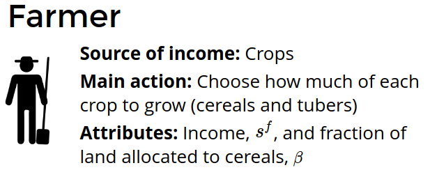
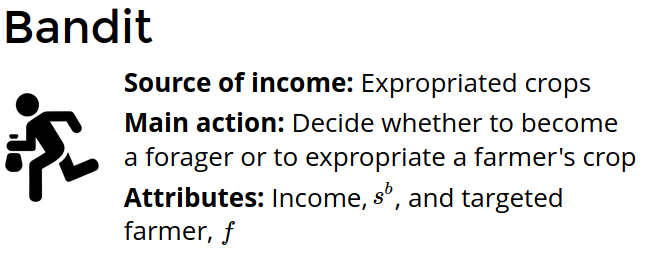
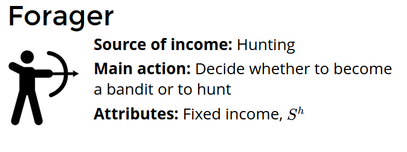
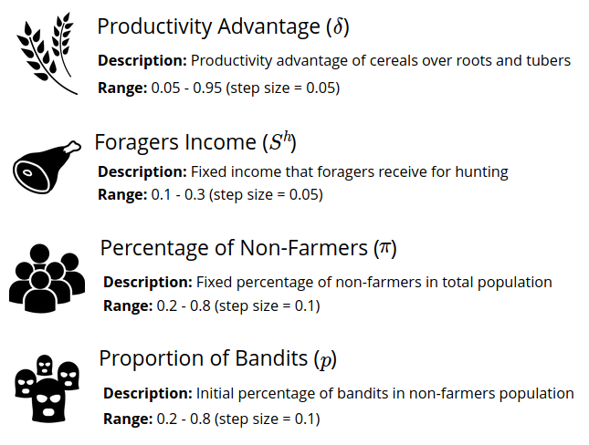
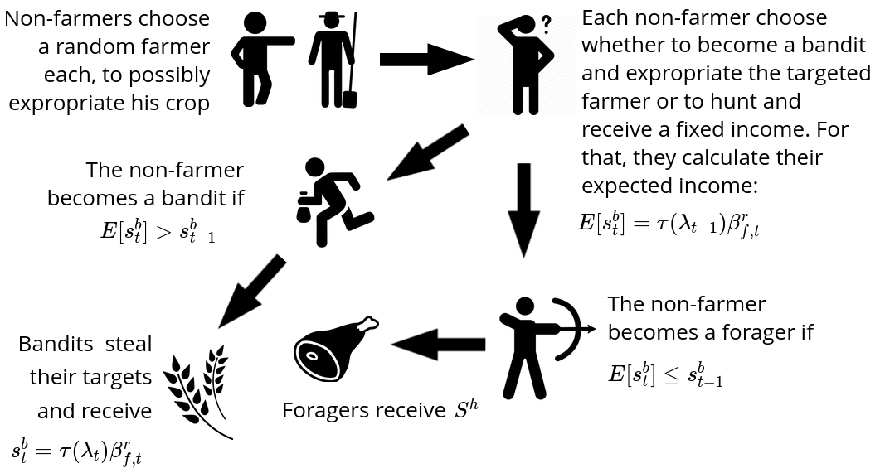
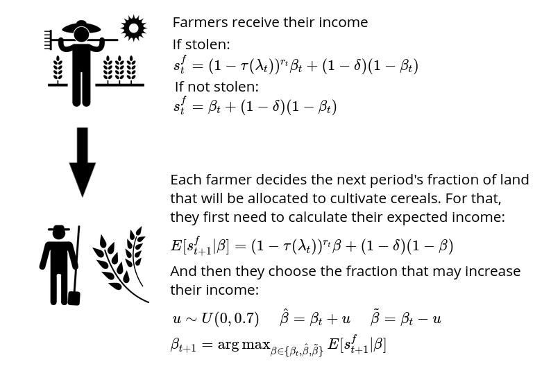
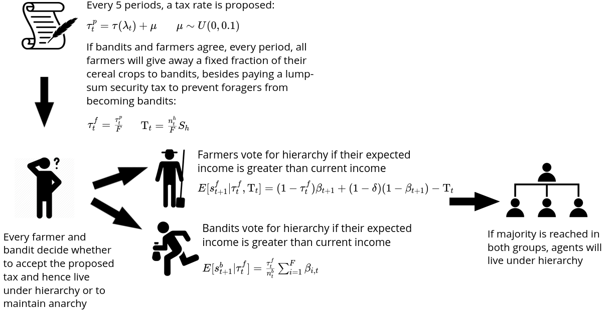

### Agents

There are two types of agents: farmers and non-farmers. Farmers have only one possible source of income, their endowed land, and land is equally distributed among them. Two kinds of crops are available: cereals (appropriable) and tubers (non-appropriable). Every period, farmers decide how much of each crop to grow next period. As for non-farmers, they have two options. They can either steal a fraction of a farmer's cereals crop or become a forager and receive a fixed income from hunting/gathering. In summary:

```{r, figures-side, fig.show="hold", out.width="33%", echo=FALSE}



```

Notation:

* $s^f$: Farmers income 
* $s^h$: Foragers fixed income
* $s^b$: Bandits income
* $\beta$: Fraction of land allocated to cultivate cereals

### Parameters

The model has four parameters, i.e. exogenous variables:

```{r, fig.show="hold", out.width="50%", echo=FALSE}

```

As in Mayshar et al. (2017), the basic assumption of this model is that regions of the world differ in their productivity of cereals relative to that of tubers, as represented by the parameter $\delta \in (0,1)$. In the model, using $x$ units of land to cultivate cereals delivers $\delta x$ more calories as compared to employing the same amount of land to grow tubers. I normalize the productivity of cereals to unity. Therefore, farmers can choose to grow any linear combination of $1$ (cereals) and $1-\delta$ (tubers).

The meaning of remaining parameters is straighforward. The total number of agents, $N$, is fixed and equal to $2000$. The number of non-farmers, $H$, is also fixed and determined by the parameter $\pi$, i.e. $H = \pi N$. The number of farmers, then, is $F = N - H$. The number of bandits, $n_{b,t}$, vary over time $t$ and, initially, is set to $n_{b,0} = p H$. 

Parameters ranges are also specified above. There are nineteen possible values for $\delta$, five for $S^h$, seven for $\pi$, and seven for $p$. Thus, parameters can be combined in $19\cdot 5 \cdot 7 \cdot 7 = 4655$ different ways. I ran 30 simulations for each of these scenarios, since there are random elements in the model. You can think of a given combination as a set of characteristics that define a territorial unit, then 30 different runs can be thought as subregions belonging to this territorial unit. 

### Protocol

The computational protocol has three stages: theft, adjustment, and council. But before describing then in detail, we need some definitions.

First, define the following sets of indexes:

$$
I = \{i | i \in [1,F] \} \mbox{   indexes farmers }\\
J = \{j | j \in [1,H]\} \mbox{   indexes non-farmers} \\
k \in J \mbox{   indexes bandits}  
$$

Let $\lambda_t = n_{b,t}/N$ be the percentage of bandits in total population at $t$ and $\tau(\lambda_t)$ an increasing and concave function that maps the percentage of bandits into a confiscation rate in the interval $(0,1]$. Define $\tau(\lambda_t)$ as follows:

$$
\tau(\lambda_t) = 
\left\{
	\begin{array}{ll}
		 0  & \mbox{if } \lambda_t = 0 \\
		 0.1 & \mbox{if } \log_{10} (10\lambda_t) < 0.1 \\
		 \log_{10} (10\lambda_t) & \mbox{otherwise. } 
	\end{array}
\right.
$$

Hence, returns to expropriation are descreasing in the percentage of bandits in total population and the confiscation rate has a minimum of $0.1$ when $\lambda_t \neq 0$.

Lastly, let $\beta_{i,t}$ be the fraction of land allocated by farmer $i$ to cultivate cereals at period $t$. This means that, at a given $t$, farmer $i$ grows $\beta_{i,t}$ units of cereals and $(1-\beta_{i,t})(1-\delta)$ units of tubers. 

Now let us describe what happens at each of the stages. In the text, I will always use agents' indexes, but I will refrain from doing so in the diagrams, to lighten the notation. 

#### 1. Theft

Non-farmers $j$ start by choosing a random farmer $f_j$ each, to possibly steal a fraction $\tau(\lambda_t)$ from $f_j$'s cereal crops. Each non-farmer then choose whether to become a bandit and expropriate the targeted farmer or to hunt and receive a fixed income. For that, they calculate their expected income as bandits: 

$$
E[s^b_{j,t}] = \tau(\lambda_{t-1}) \beta_{f_j,t} 
$$

The non-farmer $j$ becomes a bandit if $E[s^b_{j,t}] > S^h$, that is, if expected income as a bandit exceeds the forager's fixed income. Obviously, the non-farmer becomes a forager otherwise.  

Next, foragers receive $S^h$ and bandits $k$ steal their targets. Since a farmer can be stolen by more than one bandit, the remaining fraction of appropriable land must be updated every time a farmer gets stolen. Let $\beta^r_{i,t}$ be this fraction, with an initial value of $\beta^r_{i,t} = \beta_{i,t}$. Then, whenever a farmer $i$ is expropriated, the bandit who targeted $i$ receive

$$
s^b_{k,t} = \tau(\lambda_{t}) \beta^r_{f_k,t} 
$$

And $\beta^r_{i,t} = \tau(\lambda_t)\beta^r_{i,t}$. The whole *theft* stage is summarized by the picture below.
$~$
```{r, fig.show="hold", fig.align = 'center', out.width="70%", echo=FALSE}

```

#### 2. Adjustment

The adjustment stage is about farmer's behaviour. First, farmers receive their income. Let $r_{i,t}$ be the number of times a farmer $i$ is stolen at $t$. Thus, the income of farmer $i$ at $t$ is given by

$$
s^f_{i,t} = (1-\tau(\lambda_t))^{r_{i,t}}\beta_{i,t} + (1-\beta_{i,t})(1-\delta)
$$
Each farmer $i$ decides the next period's fraction of land that will be allocated to cultivate cereals, $\beta_{i,t+1}$. For that, they first need to calculate their expected income, which for any given $\beta$ is

$$
E[s^f_{i,t+1} | \beta] = (1-\tau(\lambda_t))^{r_{i,t}}\beta + (1-\delta)(1-\beta)
$$

Using this expression, farmers choose the fraction that may increase their income. They consider three options: the current fraction, the current fraction plus a random component, and the current fraction minus a random component.

$$
u \sim U(0,0.7) \\
\hat{\beta} = \beta_t + u \\
\tilde{\beta} = \beta_t - u \\
\beta_{t+1} = \arg\max_{\beta \in \{\beta_t, \hat{\beta}, \tilde{\beta}\}} E[s^f_{t+1} | \beta]
$$
The choice of the upper bound for $u$ was arbitrary. The diagram below shows all the steps discussed above. 

$~$
```{r, fig.show="hold", fig.align = 'center', out.width="70%", echo=FALSE}

```

#### 3. Council

Every five periods, bandits and farmers try to reach an agreement. A tax rate $\tau^p_t$ is proposed. The idea is that farmers deliver a small part of their cereals to bandits every period, to avoid the uncertainty of being possibly stolen. To make it attractive to bandits, it should be higher than the current confiscation rate: 

$$
\tau^p_t = \tau(\lambda_t) + \mu \\
\mu \sim U(0,0.1)
$$

If agreed, each farmer will give away a fraction $\tau^f_t = \frac{\tau^p_t}{F}$ of their cereal crops to bandits beggining at $t+1$. In addition, farmers need to pay a lump-sum security tax $T_t$ to discourage foragers from becoming bandits. Naturally, the smallest possible value for $T_t$ is the total income received by foragers divided by the number of farmers, $T_t = \frac{n^h_{t}}{F} S_h$ . Note that the subscript $t$ in $T_t$ and $\tau^p_t$ merely indicates that these taxes were proposed at $t$, but if agents aprove them, they will remain fixed thereafter.

Now farmers and bandits decide whether to accept the proposed tax and hence live under hierarchy or to maintain anarchy. Each of them vote individually considering their present situation and future expectations. An agent vote for hierarchy if their expected income is greater than current income. For farmers, expected income is

$$
E[s^f_{i,t+1} | \tau^{f}_t, T_t] =  (1-\tau^f_{t})\beta_{t+1} + (1-\delta)(1-\beta_{t+1}) - T_t
$$
So a farmer $i$ votes for hierarchy if $E[s^f_{i,t+1} | \tau^{f}_t, T_t] > s^f_{i,t}$. As for bandits, their expected income is

$$
E[s^b_{k,t+1} | \tau^f_t] = \frac{\tau^f_t}{n^b_t} \sum_{i = 1}^{F} \beta_{i,t}  
$$

So a bandit $k$ votes for hierarchy if $E[s^b_{k,t+1} | \tau^f_t] > s^b_k$. If majority is reached in both groups, agents will live under hierarchy. In this case, the henceforth stationary bandits will not steal anymore and the first stage, *theft*, will be skipped in every following period. Nevertheless, farmers will still be able to modify $\beta$, so both farmers' and stationary bandits' income remains variable. 

The stage described above is depicted in the diagram that follows.
$~$
```{r, fig.show="hold", fig.align = 'center', out.width="100%", echo=FALSE}

```


<!-- {width=30%} {width=30%} {width=30%} -->

